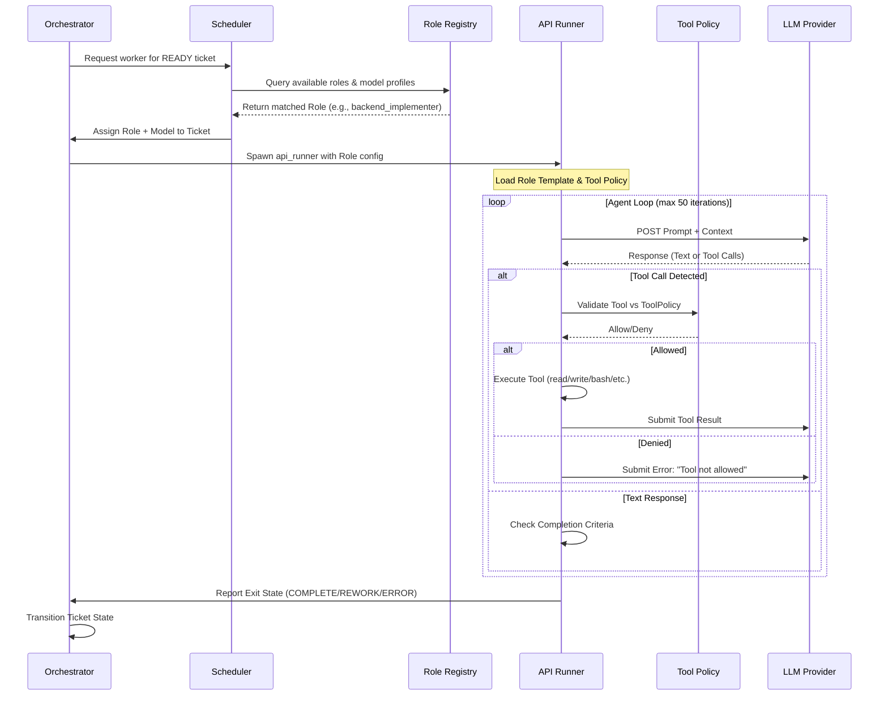

# CodeBot Architecture

Last updated: 2026-09-25

## System Overview

CodeBot is a portable autonomous software engineering platform. It discovers work, plans implementation, executes changes through LLM-powered agents, verifies results through deterministic quality gates, and commits verified changes back to the target repository.

CodeBot operates as a standalone entity. It reads a project's `.codebot/project.yaml` contract to understand what to work on, resolves all paths through a `ProjectAdapter` interface, and writes results back via git. It contains zero project-specific knowledge in its core.

```
┌─────────────────────────────────────────────────────────────┐
│                      CodeBot Core                           │
│                                                             │
│  ┌──────────┐  ┌──────────────┐  ┌────────────────────┐   │
│  │Orchestrator│→│   Scheduler   │→│   API Runner       │   │
│  │(process   │  │(ticket store, │  │(LLM calls, tool   │   │
│  │ lifecycle)│  │ dep graph,   │  │ execution, claim)  │   │
│  └──────────┘  │ risk scoring)│  └────────┬───────────┘   │
│       ↑        └──────────────┘           │               │
│       │                                   ↓               │
│  ┌──────────┐  ┌──────────────┐  ┌────────────────────┐   │
│  │ Bootstrap │  │Role Registry │  │  Quality Gate      │   │
│  │(adapter  │  │(29 roles,    │  │  (YAML policy,     │   │
│  │ injection)│  │ legacy map)  │  │  gatekeeper)       │   │
│  └──────────┘  └──────────────┘  └────────────────────┘   │
│       ↑                                   │               │
│       │              ┌──────────────┐     │               │
│       └──────────────│ ProjectAdapter│←────┘               │
│                      │ (ABC)        │                     │
│                      └──────┬───────┘                     │
└─────────────────────────────┼─────────────────────────────┘
                              │
                    ┌─────────┴─────────┐
                    │  .codebot/         │
                    │  project.yaml      │
                    │  constitution.md   │
                    │  quality_gates.yaml│
                    └───────────────────┘
                              │
                    ┌─────────┴─────────┐
                    │  Target Repository │
                    │  (Monitor, etc.)   │
                    └───────────────────┘
```

## Role Management API

CodeBot uses a role-based abstraction instead of hardcoded bot names. Roles define *what* an agent does, while model profiles define *how smart* it is, and tool policies define *what it can touch*.

### Role Categories

There are 24 registered roles in `role_registry.py` (31 counting legacy/planning prompt-only) across 5 categories. Scheduler uses `scheduler_v2` buckets GOAL/DECOMP/PLANNING/REWORK/IMPLEMENT/REVIEW; discovery runs as a 5-slot daemon outside the scheduler (60s per role) and is not a scheduler bucket.

| Category | Count (registered) | Purpose | Example Roles |
|----------|-------------------|---------|---------------|
| **Discovery** | 9 | Scan codebase for issues, vulnerabilities, debt | `bug_hunter`, `security_auditor`, `architecture_auditor` |
| **Planning** | 3 | Decompose, plan, goal-align | `decomposer`, `planner`, `goal_aligner` |
| **Implementation** | 1 | Execute changes, write code, fix bugs | `implementer` |
| **Review** | 6 | Verify correctness, security, architecture, concurrency, data integrity | `reviewer`, `security_reviewer`, `concurrency_reviewer` |
| **Control** | 5 | Orchestrate workflow, manage state, mirror | `ticket_triager`, `git_sync`, `github_mirror`, `scheduler`, `budget_controller` |

### Data Structures

-   **`AgentRole`**: Immutable definition containing name, category, description, required model profile, tool policy, incentive, and adversarial mappings.
-   **`ModelProfile`**: Specifies capability requirements (reasoning level, coding skill, context size, cost class, latency, security review flag).
-   **`ToolPolicy`**: Fail-closed allowlist defining permitted tools (`read`, `write`, `bash`, etc.), permitted commands (`git`, `pytest`, etc.), filesystem scope, network access, git write access, and max file size.

## Discovery vs Scheduler

Discovery runs as a 5-slot daemon outside the scheduler. See `docs/scheduler.md` and `docs/discovery.md`.

- Scheduler (`scheduler_v2`, 90 slots) handles GOAL, DECOMP, PLANNING, REWORK, IMPLEMENT, REVIEW bucket dispatches via `DispatchGate` claims.
- Discovery daemon (`discovery_daemon.py`, 5 slots, 60s per role, 9 roles round-robin) only does `read`/`batch_grep`/`create_ticket` with a `CHANGED_FILES` dirty-first hint and never holds a claim.
- Both are started by `orchestrator_runtime.run_main_loop` and share `process_manager` for subprocess launch. Scheduler exclusivity is enforced by skipping `DISCOVERY_ROLE_NAMES` in `apply_agent_availability` and `start_eligible_bots`.

### Interaction with API Runner

The `api_runner.py` executes the agent loop constrained by the assigned role's `ToolPolicy`:

1.  **Role Assignment**: The Orchestrator/Scheduler assigns a role to a ticket based on ticket class and current queue pressure.
2.  **Prompt Assembly**: `role_prompt.py` loads the role-specific template and injects project context.
3.  **Tool Enforcement**: `api_tools.py` validates every tool call against the role's `ToolPolicy`. Calls outside the allowlist are rejected before execution.
4.  **Iteration Limit**: Each run is capped at 50 tool-call iterations to prevent runaway loops.
5.  **Claim Protocol**: The agent claims the ticket (`state/claims/{id}.{agent}.json`) before working and releases it upon completion or failure.

### Role Management Data Flow



## Core Modules

| Module | Lines | Purpose |
|--------|-------|---------|
| `scheduler_v2/lifecycle.py` | ~330 | AgentState (CREATED→DEAD), AgentRecord, Clock/ProcessSpawner protocols, per-model stale timeouts |
| `scheduler_v2/dispatch_gate.py` | ~490 | DispatchGate (ConcurrencyController + claims + SpawnQueue 0.5s stagger) |
| `scheduler_v2/dispatcher.py` | ~545 | Scheduler, ModelSelector, ReasonCode, reconciliation sweeps (orphan claims, leaked slots, stale verify) |
| `scheduler_v2/bucket_dispatcher.py` | ~363 | BucketDispatcher (7 buckets: GOAL/DECOMP/PLANNING/REWORK/IMPLEMENT/REVIEW/VERIFY), BUCKET_ORDER, BUCKET_TO_ROLE_SETS |
| `discovery_daemon.py` | ~385 | 5-slot discovery outside scheduler, round-robin 9 roles, 60s cooldown, dirty-file CHANGED_FILES, cheap tier |
| `orchestrator.py` | ~490 | Thin coordinator, delegates to orchestrator_runtime/process_manager/health_check_loop |
| `orchestrator_runtime.py` | ~240 | Bootstrap adapter, shutdown handlers, run_main_loop (spawns discovery daemon thread) |
| `orchestrator_services.py` | ~670 | Bot registry loading from adapter, skip-discovery in apply_agent_availability |
| `health_check_loop.py` | ~913 | Per-tick bot lifecycle, drain loop with pre-spawn review packet gate + post-spawn survival check, rate-limit retry cap (5x→REWORK), dispatcher invocation |
| `process_manager.py` | ~1270 | Bot lifecycle start/stop/restart, `_prepare_prompt_with_context(extra_block)` for CHANGED_FILES |
| `scheduler_config.py` | 36 | Flat config constants: MAX_CONCURRENT_AGENTS=90, ROLE_CAPS, BUCKET_WEIGHTS, SPAWN_STAGGER_SECONDS=5.0 |
| `pipeline_state.py` | ~350 | Frozen dataclass snapshot of the entire engineering pipeline for scheduler decisions |
| `ticket_engine.py` | ~2300 | Schema v3 (19 states incl. GOAL/LATER/NEVER/RESOLVED), WAL + compaction, fingerprint dedup |
| `role_registry.py` | ~475 | 24 role definitions (9 discovery + 1 impl + 6 review + 5 control + 3 planning) |
| `roles/*.md` | 22–26 | 8 scanner prompts lean (batch_grep + CHANGED_FILES), feature_hunter index-driven |
| `discovery_finding.py` | ~560 | Structured finding schema with evidence separation, fingerprinting, validation |
| `evidence_validator.py` | ~520 | Pre-ticket verification (file/symbol, generated/vendor hallucination) |
| `dispatch_service.py` | ~868 | Pipeline state, agent availability (skips discovery), ticket transitions (REVIEW→VERIFY, VERIFY→COMPLETE), empty-work guard, model rotation |
| `api_runner.py` | ~3378 | LLM execution loop, tool dispatch, bounded I/O (MAX_SIZE=2MB), streaming deadline enforcement, create_ticket list coercion, verdict ast.literal_eval fallback |
| `prompt_gateway.py` | ~210 | Prompt compression, shared contract injection |
| `config_reloader.py` | ~160 | Hot-reloading for prompts, source code, and bot registry config |
| `dependency_graph.py` | ~160 | DAG, cycle detection, topological sort, ready-ticket resolution |
| `risk_classifier.py` | ~100 | Deterministic risk scoring (0-100), constitution-aware autonomy |
| `implementation_planner.py` | ~170 | Risk-scaled plan generation (summary/standard/full depth) |
| `quality_gate.py` | ~250 | YAML-driven gate engine, subprocess evaluation, conditional triggers |
| `gatekeeper.py` | ~120 | Central completion authority, max 3 rework cap, REWORK escalation |
| `control_server.py` | ~660 | HTTP control plane: agent status, logs, restart, drain, remote management |
| `codebot_adapter.py` | ~300 | Self-hosting adapter: intervals discovery 60s, planning 3600s, implementation 300s |
| `model_manager.py` | ~260 | Model profiles (lockup risk, heartbeat_multiplier, restart_cooldown), rotation |
| `alignment_service.py` | ~250 | Decoupled alignment pipeline for reward scoring and prompt evolution |
| `adaptive_rate_limiter.py` | ~200 | Adaptive rate limiting based on API provider feedback |
| `checkpoint_manager.py` | ~200 | Agent checkpoint save/restore for crash recovery |
| `file_lock.py` | ~120 | Cross-process file locking primitives for safe concurrent state access |
| `state_manager.py` | ~200 | PathConfig, drain/lock/restart flags, adapter injection |
| `scheduler_v2/__init__.py`, `workforce_*` | ~100 | Bucket/workforce helpers |

Archived/removed: `adaptive_scheduler.py`, `discovery_manager.py` (classic), `migrate_queue.py`, `integration_queue.py`, `metrics_collector.py`, `quality_metrics.py`, `batch_scheduler.py`, `lifecycle_scheduler.py`.

### Capability Modules (CAP Pipeline)

| Module | Purpose |
|--------|---------|
| `web_tools.py` | **SSRF-safe internet research**: provides `web_search()` (DuckDuckGo HTML lite) and `web_fetch()` (bounded HTTP GET with 1MB cap). Implements strict allowlisting of HTTP/HTTPS schemes, blocks private IP ranges (10.x.x.x, 172.16-31.x.x, 192.168.x.x, 127.x.x.x), enforces redirect limits, and validates DNS resolution to prevent server-side request forgery attacks. |
| `context_compactor.py` | Sliding window message summarization when approaching token budget |
| `scratchpad.py` | Ticket-scoped cross-agent context handoff via `ScratchpadState` and `AgentRecord` dataclasses; atomic JSON writes (tmp + os.replace) with 8KB hard cap; fail-open reads on corruption; enables seamless lifecycle handoffs between agents |
| `task_splitter.py` | Decomposes oversized tickets into ≤10 sub-tasks on agent failure |
| `coverage_runner.py` | Runs pytest-cov, parses output into per-module coverage reports |
| `coverage_bridge.py` | Generates tickets from coverage gaps, computes coverage delta scores |
| `botop.py` | Standalone CLI for agent operations (status, logs, restart, drain, tickets) |

### Infrastructure Modules

| Module | Purpose |
|--------|---------|
| `stats_collector.py` | Per-model API call statistics tracking (success, cost, tokens) |
| `telemetry.py` | HTTP ingestion endpoint for production telemetry signals to create tickets |
| `api_tools.py` | read/write/edit/bash/grep/glob tool implementations for LLM agents |
| `tool_policy.py` | Sandbox boundary: path resolution, command allowlisting |
| `readiness.py` | Readiness checks, noop detection, queue complexity parsing |
| `batch_scheduler.py` | Tier-based batch ordering, concurrency packing, capability caps |
| `manifest_schema.py` | Manifest loading and validation |
| `lease_state.py` | Distributed coordination via file-based leases |
| `event_log.py` | Append-only event persistence |
| `findings_log.py` | Findings persistence |
| `migrations/` | Database/schema migration scripts (migration_001, 003, 004) |
| `anomaly_alerts.py` | Anomaly detection on metrics |
| `auto_revert.py` | Automatic rollback on build gate failure |
| `module.py` | Example module demonstrating proper exception handling patterns |
| `alignment_coordinator.py` | Coordinates alignment pipeline across agents |
| `dispatch_service.py` | Ticket dispatch orchestration service |
| `freeze_detector.py` | Detects and handles process freeze conditions |
| `lifecycle_scheduler.py` | Process lifecycle management and scheduling |
| `orchestrator_services.py` | Supporting services for the orchestrator |
| `process_manager.py` | OS process spawning, monitoring, and cleanup |
| `quality_metrics.py` | Quality-specific metrics tracking and reporting |
| `state_manager.py` | Centralized state management for runtime data |
| `ticket_dispatcher.py` | Dispatches tickets to appropriate agent roles |
| `worker_scaler.py` | Dynamic worker count scaling based on queue pressure |

## Data Flow

```
Discovery daemon (5-slot, outside scheduler, 60s each)
├── bug_hunter / security_auditor / ... / feature_hunter (read-only)
│   └── batch_grep dirty files (CHANGED_FILES hint) → read hits → self-challenge
└── ticket_engine.create_ticket() → DISCOVERED (fingerprint/evidence dedup)
    │
    ▼
ticket_triager + goal_aligner validate → TRIAGED → GOAL (NOW/LATER/NEVER)
    │
    ▼
decomposer builds DAG (.decomp.json) → DECOMP → PLANNING
    │
    ▼
planner generates plan (.plan.json) → IMPLEMENT
    │
    ▼
scheduler_v2 BucketDispatcher picks bucket, assigns role + model → REVIEW swarm after impl
    │
    ▼
api_runner executes via LLM with tools
    ├── Claims ticket (claims/{ticket}.{role}.claim.json via DispatchGate)
    ├── Writes failing test (TDD red)
    ├── Implements change (TDD green)
    ├── Runs pytest (verify)
    ├── Releases claim
    └── Transitions → REVIEW (no commit here)
    │
    ▼
Reviewers (11 roles: reviewer + 10 specialists)
    ├── Read review_packets/{ticket_id}.json (created by implementer completion or scheduler pre-spawn gate)
    ├── APPROVE → VERIFY
    └── REWORK → REWORK (increment rework_count, back to IMPLEMENT or PLANNING)
    │
    ▼
Verifier (verifier role, read-only tools: read/grep/glob, no bash)
    ├── Reads review packet + changed files statically
    ├── Writes verdict to verification/{ticket_id}.json
    ├── APPROVE → COMPLETE
    └── REWORK → REWORK
    │
    ▼
Stale verify sweep: VERIFY tickets >10min with no live verifier auto-approved → COMPLETE
    │
    ▼
quality_gate + gatekeeper runs gates (YAML policy)
    ├── ALL PASS → COMPLETE
    └── ANY FAIL → REWORK (if rework_count < 3)
    │
    ▼
completion_commit commits the ticket's own files with [CB-xxx] message,
records SHA on the ticket (fail-open; no push — push stays batched)
    │
    ▼
alignment_scorer → rl_engine updates Q-values → prompt_optimizer refines prompts
```

## State Machine

Schema v3 (19 states incl. aliases). `TicketState` aliases: `DECOMPOSE=DECOMP`, `IMPLEMENTING=IMPLEMENT`, `REVIEWING=REVIEW`.

```
DISCOVERED → TRIAGED → GOAL → DECOMP → PLANNING → IMPLEMENT → REVIEW → VERIFY → COMPLETE
    ↓           ↓         ↓        ↓         ↓           ↓          ↓       ↓
 REJECTED   DUPLICATE  LATER    BLOCKED   BLOCKED   REWORK/RESOLVED REWORK  REWORK/RESOLVED
 NOT_ACTIONABLE        NEVER   RESOLVED  RESOLVED  CANCELLED     CANCELLED CANCELLED
 RESOLVED   RESOLVED CANCELLED CANCELLED CANCELLED
 SUPERSEDED SUPERSEDED        SUPERSEDED
 CANCELLED  CANCELLED
        REWORK ←─────┐  (REWORK → [IMPLEMENT|PLANNING|DECOMP|DEFERRED|RESOLVED|SUPERSEDED|CANCELLED])
        DEFERRED     │  (BLOCKED → [DECOMP|PLANNING|DEFERRED])
        LATER ─→ GOAL┘  (LATER → [GOAL|RESOLVED|SUPERSEDED|CANCELLED])
```

Goal alignment: `TRIAGED → GOAL (NOW→DECOMP / LATER / NEVER via goal_aligner)`. Terminals: `COMPLETE`, `REJECTED`, `DUPLICATE`, `NOT_ACTIONABLE`, `RESOLVED`, `SUPERSEDED`, `CANCELLED`, `NEVER` (no exits). All non-COMPLETE can go to `RESOLVED|SUPERSEDED|CANCELLED` universal exits. Valid transitions are enforced by `TRANSITIONS` dict in `ticket_engine.py`; invalid raises `ValueError`.

## Concurrency Model

- **Orchestrator**: single process + 2 thread pools: scheduler_v2 (90 slots via DispatchGate + ClaimRecord + SpawnQueue 5.0s per-role stagger) and discovery daemon (5 slots, round-robin, 60s cooldown via BotState.next_run_at + _last_run, 2s stagger, yarn-style dirty-first via CHANGED_FILES)
- **Claims**: scheduler tickets use `claims/ticket--{ticket_id}.claim.json` with `flock` on `.claim.lock` (atomic tmp+replace). `_reconcile()` sweeps orphaned claims by cross-referencing live PIDs via `pgrep`. Discovery is claim-free — only `create_ticket`.
- **Heartbeat monitoring**: each agent writes timestamp to `.codebot/state/{name}.heartbeat` after every atomic task; orchestrator kills agents exceeding `effective_timeout` (model-aware: xiaomi 1.5x → thinking 2.8x)
- **TicketStore**: `threading.RLock` + WAL + periodic compaction (`TicketStore.flush()`); debounce 0.5s batch; `BACKUP_EVERY_N_COMPACT=5`, max file size 50MB guard; `weakref` atexit registry for clean close across daemon + workers
- **Drain flag**: `.codebot/state/.drain` file — `dispatch_service` + daemon `tick()` both check `state_manager.is_draining()` before launch; graceful shutdown via `run_main_loop` SIGINT/SIGTERM joining daemon
- **Adapter wiring**: `codebot_adapter.bot_registry` intervals drive daemon cooldown; stale dynamic workers pruned by `orchestrator_runtime.prune_stale_dynamic_bot_state`

## Security Properties

| Property | Implementation |
|----------|---------------|
| Bounded I/O | All reads capped at 1MB (`resp.read(1_000_000)`) |
| No shell injection | `subprocess.run(shell=False)` with argv splitting |
| No path traversal | `resolve_workspace_path()` validates against workspace root |
| Command allowlisting | `tool_policy.allowlisted_command()` rejects unknown commands |
| Credential isolation | Secrets resolved from env vars only, never hardcoded |
| Atomic writes | `tmp.write_text()` + `os.replace()` prevents partial writes |
| No type suppression | Zero `as any`, `@ts-ignore`, or equivalent patterns |
| Streaming API deadline | Absolute timeout enforced on streaming reads via socket.settimeout(remaining_time) |

## Performance Characteristics

| Operation | Complexity | Notes |
|-----------|-----------|-------|
| Ticket CRUD | O(1) dict lookup | `self._tickets[id]` |
| Evidence dedup | O(1) hash lookup | `self._evidence_index[hash]` |
| State serialization | O(n) tickets | Under lock, then I/O outside lock |
| Dependency sort | O(V + E) | Kahn's algorithm |
| Ready tickets | O(V) scan | Filter by satisfied dependencies |
| Risk scoring | O(1) | Deterministic formula |
| Gate evaluation | O(g) gates | Each gate is independent subprocess |
| Role resolution | O(1) dict lookup | `LEGACY_ROLE_MAP[name]` |

## Adapter Interface

Every managed project implements `ProjectAdapter` (13 abstract methods):

```python
class ProjectAdapter(ABC):
    def project_name(self) -> str
    def paths(self) -> ProjectPaths
    def test_config(self) -> ProjectTestConfig
    def dependency_policy(self) -> DependencyPolicy
    def autonomy_config(self) -> AutonomyConfig
    def components(self) -> list[ComponentDef]
    def bot_registry(self) -> list[dict]
    def model_profiles(self) -> dict[str, dict]
    def tier_priority(self) -> dict[str, int]
    def prompt_directory(self) -> Path
    def api_runner_command(self, bot_name, prompt_file) -> list[str]
    def is_protected_path(self, path) -> bool
    def validate_project(self) -> list[str]
```

CodeBot core resolves all paths, configs, and registries through this interface. Adding support for a new project means implementing this ABC — zero changes to CodeBot core required.
